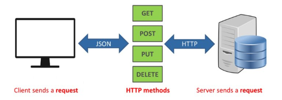
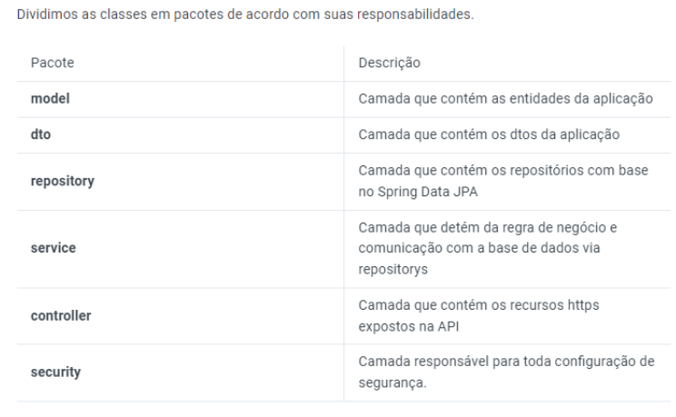
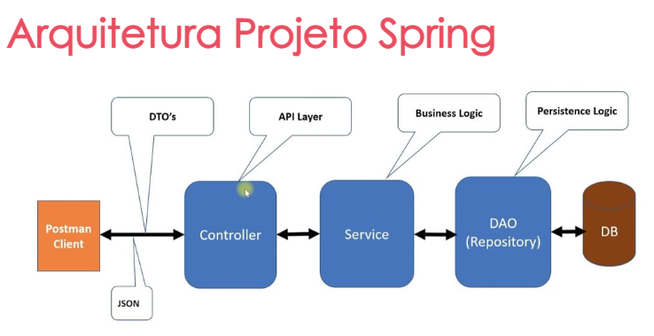

# Dominio da aplicação - Portfolio Crypto

com.coolwallet.controller 
└── CustomUserDetailsService 
└── SecurityConfig 

com.coolwallet.controller 
├── UserController.java 
├── PortfolioController.java 
├── CryptocurrencyController.java 
└── TransactionController.java 

com.coolwallet.dto 
└── CryptocurrencyDTO  
└── PortfolioDTO 
└── TransactionDTO 
└── UsersDTO 

com.coolwallet.model 
├── User.java 
├── Portfolio.java 
├── Cryptocurrency.java 
└── Transaction.java 

com.coolwallet.service 
├── UserService.java 
├── PortfolioService.java 
├── CryptocurrencyService.java 
└── TransactionService.java 
com.coolwallet.service.impl  
    └──CryptocurrencyServiceImpl.java 
    └──PortfolioServiceImpl.java 
    └──TransactionServiceImpl.java 
    └──UserServiceImpl.java 

com.coolwallet.repository 
├── UserReposiroty.java 
├── PortfolioRepository.java 
├── CryptocurrencyRepository.java 
└── TransactionRepository.java 

 CoolWalletProjectApplication 

# Portfolio Crypto
O Portfolio Crypto é um projeto de aplicação que visa fornecer recursos relacionados a criptomoedas, permitindo que os usuários gerenciem suas carteiras de criptomoedas e realizem transações. A aplicação é desenvolvida em Java e segue uma estrutura organizada e modularizada para facilitar a manutenção e expansão futura.

## Funcionalidades
O Portfolio Crypto oferece as seguintes funcionalidades:

* Registro e autenticação de usuários.
* Gerenciamento de informações de usuário, incluindo detalhes pessoais e informações de contato.
* Criação e atualização de portfólios de criptomoedas.
* Adição, remoção e atualização de criptomoedas no portfólio.
* Registro de transações de compra e venda de criptomoedas.
* Acesso a informações em tempo real sobre preços e estatísticas das criptomoedas.
## Estrutura do Projeto

O projeto é organizado em diferentes pacotes e classes, seguindo as melhores práticas de desenvolvimento. A estrutura do projeto é a seguinte:

* com.coolwallet.controller: Pacote contendo as classes responsáveis pelo controle da aplicação, incluindo recursos de segurança e autenticação.

* com.coolwallet.dto: Pacote que contém as classes DTO (Data Transfer Object) utilizadas para transferir dados entre as diferentes camadas da aplicação.

* com.coolwallet.model: Pacote contendo as classes de modelo que representam as entidades do sistema, como usuários, portfólios e transações.

* com.coolwallet.service: Pacote contendo as interfaces e implementações dos serviços relacionados às entidades do sistema.

* com.coolwallet.repository: Pacote contendo as interfaces de repositório responsáveis pela persistência dos dados.

## Pré-requisitos
Antes de executar a aplicação, certifique-se de ter os seguintes pré-requisitos instalados em seu ambiente de desenvolvimento:

* Java Development Kit (JDK) 8 ou superior
* Maven 3.x.x
## Configuração e Execução
Em construção

## Contribuição
Contribuições são bem-vindas! Se você deseja contribuir para o desenvolvimento do Portfolio Crypto.

## Suporte
Se você encontrar algum problema ou tiver alguma dúvida sobre o Portfolio Crypto, sinta-se à vontade para abrir uma nova issue no repositório do projeto. Faremos o possível para responder e solucionar o problema o mais rápido possível.

## Licença
O Portfolio Crypto é distribuído sob a licença MIT. Sinta-se à vontade para utilizar, modificar e distribuir o código conforme necessário.

## Autor

Caio B. Zamana

## Agradecimentos
Gostaríamos de expressar nossa gratidão à comunidade de desenvolvedores e às diversas bibliotecas de código aberto que tornaram este projeto possível. Obrigado por compartilharem seu conhecimento e recursos.
